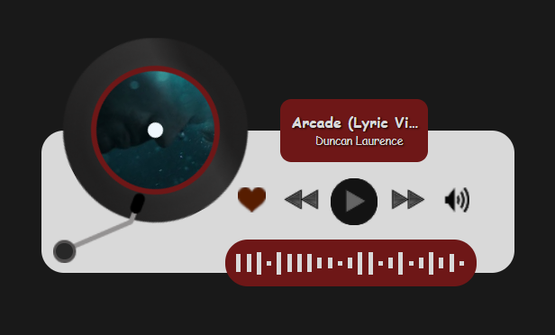

# 🎵 Musicfy  
A lightweight desktop widget that displays **real‑time YouTube Music metadata** and gives you **playback control** — all through a custom browser extension and a Tauri‑powered desktop app.
Built with **React**, **Tauri (Rust)**, and a **bidirectional WebSocket bridge** for fast, seamless communication.
 
**Current version: 1.0.0**

---

## ✨ Features

### 🎶 **Live Song Metadata** — Displays title, artist, album, and artwork in real time
### 🔊 **Volume Control** — Adjust YouTube Music's playback volume directly from the widget
### ❤️ **Like/Favorite Sync** — Like or unlike the current song from the widget, with live sync to YouTube Music's own like state
### 🔁 **Bidirectional Communication** — The widget doesn't just display state anymore — it sends commands back to your YouTube Music tab
### ⏯️ **Playback Controls** — Play/pause, next, and previous track
### 🪟 **Transparent Desktop Widget** — Always‑on‑top, minimal, and fully transparent — the widget floats over your desktop with no background window
### 🎨 **Redesigned UI** — A compact vinyl‑record‑inspired player card with a spinning disc, waveform accent, and a warm dark red/black color palette (replacing the earlier pixel‑art look)
### 🧩 **Chrome/Edge Extension** — Extracts metadata directly from YouTube Music and relays commands back to it
### 🖥️ **Cross‑Platform Ready** — Build for Windows, macOS, and Linux
### 🔒 **Double‑Injection Safe** — Prevents duplicate content script execution
### 📦 **Installer Support** — Build `.exe`, `.msi`, `.dmg`, `.AppImage`, and more

---

## 🖼️ Preview
 

  

*The dark background above is just the desktop behind it — the widget itself is fully transparent.*
 
---

## 🛠️ Technologies Used  

### **Frontend (Widget)**
- **React** — UI components
- **TypeScript** — Type-safe component and state logic
- **CSS3** — Styling, animations, transparency
### **Backend (Rust / Tauri)**
- **Tauri Core** — Desktop wrapper, window management
- **WebSocket Server** (`tungstenite`) — Bidirectional bridge between extension and app
- **Rust** — Fast, lightweight backend logic
- **Windows Subsystem = GUI** — Removes console window on launch
### **Browser Extension**
- **JavaScript (ES6+)** — Metadata polling and DOM control
- **MediaSession API** — Extracts song info
- **WebSocket Client** — Sends metadata to Tauri and receives commands back
- **Manifest v3** — Modern extension architecture

---

## 🎧 How It Works
 
- The extension reads metadata (and playback state — volume, mute, like status) from YouTube Music
- It sends that data through a WebSocket to the Musicfy app, which updates the widget in real time
- When you interact with the widget — dragging the volume slider or clicking the like button — the app sends a command back down the same WebSocket to the extension, which applies it directly on the YouTube Music page
- No login, no setup — just play music and enjoy

---

## 🔧 Process Overview

### 🧠 Designed the widget layout and transparent UI
### 🧩 Built the YouTube Music content script (`inject.js`)
### 🔌 Implemented WebSocket communication between extension → Tauri
### 🎧 Connected metadata updates to React state
### 🔁 Extended the WebSocket bridge to be bidirectional, enabling widget → YouTube Music commands
### 🔊 Added volume control, with state lifted to a single source of truth in `App.tsx`
### ❤️ Added like/favorite sync, reading and toggling YouTube Music's native like button
### 🪟 Configured Tauri window (transparent, no decorations, always on top)
### 🎨 Redesigned the UI around a spinning vinyl disc and warm dark red color palette
### 📦 Added icon support (`.png` + `.ico`) for installers
### 🛠️ Built release installers for Windows
### 🚫 Removed console window using `windows_subsystem = "windows"`
### 🧪 Tested metadata and control flow across multiple songs, locales, and page transitions 

---

## ⚠️ Challenges Faced  

### 🔍 **YouTube Music SPA behavior** — Content script not reloading on navigation
### 🧩 **Double injection issues** — Solved with a global guard in `inject.js`
### 🌐 **WebSocket stability** — Ensured reconnection and error handling
### 🔁 **One-way to two-way WebSocket** — The original bridge only read from the socket; adding outgoing commands required a channel-based approach so writes and reads could interleave without blocking
### 🌍 **Locale-dependent selectors** — Early like-button detection relied on `aria-label="Like"`, which broke on non-English YouTube Music UIs; fixed with a locale-independent selector
### 📋 **Multiple like-button elements** — YouTube Music can render a like button per queue row, not just the player bar; selectors now scope to `ytmusic-player-bar` to avoid picking the wrong song's state
### 🔢 **Non-finite volume values** — Guarded against `NaN`/`undefined` values reaching `video.volume`, which otherwise threw a runtime error
### 🪟 **Transparent window quirks** — Dragging, focus, and shadow issues
### 🖼️ **Long song titles** — Added ellipsis / scrolling options
### 🔐 **Extension permissions** — Ensuring correct matches for `music.youtube.com`
### 📦 **Windows packaging** — Required `.ico` file for MSI builds

---

## 🚀 Future Improvements

### 🎨 Add theme customization (light/dark/pixel)
### 📡 Add support for Spotify, Apple Music, and local players
### 🖼️ Add blurred album‑art background mode
### 📱 Create a mobile companion app
### 🔔 Add notifications for song changes
### 🧪 Add unit tests for metadata parsing
### 🌍 Publish the extension to the Chrome Web Store
### 🧰 Add auto‑update support for the desktop app
### 👎 Add dislike button support alongside like  

---

## 📥 How to Download & Install Musicfy

You can download both the **desktop app** and the **browser extension** from my Google Drive folder:

👉 **Download Musicfy (App + Extension)**  
[Click here](https://drive.google.com/drive/folders/1TjfUBiJgtPjNQI9elZeuJJiVtRg0i0KR?usp=drive_link)

Both the extension and the `.msi` installer have been updated to **version 1.0.0** with volume and like controls included.
 
Follow the steps below depending on what you want to install.

---

# 🖥️ Install the Musicfy Desktop App (Windows)

1. Download **Musicfy.msi** (or the latest installer) from the Google Drive folder
2. Run the installer and follow the setup steps
3. Windows may show a SmartScreen warning
   - Click **More info**
   - Click **Run anyway**
4. The widget will appear on your desktop
   - Always‑on‑top
   - Transparent
   - Ready to receive metadata from the extension

---

# 🧩 Install the Musicfy Browser Extension (Chrome / Edge)

1. Download the folder **musicfy-extension** from Google Drive
2. Extract the ZIP (if it's zipped)
3. Open your browser and go to:
   **Chrome:** chrome://extensions
   **Edge:** edge://extensions
4. Enable **Developer Mode** (top right)
5. Click **Load unpacked**
6. Select the **musicfy-extension** folder
7. The extension will appear in your extensions list
8. Open **YouTube Music** and start playing a song
9. The widget will instantly show:
   - Title
   - Artist
   - Album
   - Artwork
   - Volume level
   - Like status 

---

# ❗ Troubleshooting

### The widget opens but stays empty
✔ Make sure the **extension is loaded**
✔ Make sure **YouTube Music is open**
✔ Make sure **Musicfy.exe is running**
✔ Refresh YouTube Music (F5)
 
### The extension doesn't load
✔ Ensure Developer Mode is ON
✔ Ensure you selected the **folder**, not a ZIP
✔ Check that `manifest.json` is inside the folder
 
### Volume slider or like button doesn't respond
✔ Refresh the YouTube Music tab after updating the extension
✔ Confirm the extension's service worker console shows the command being received (`chrome://extensions` → Musicfy → **service worker**)
✔ Make sure only one YouTube Music tab is active — commands are relayed to the most recently active tab
